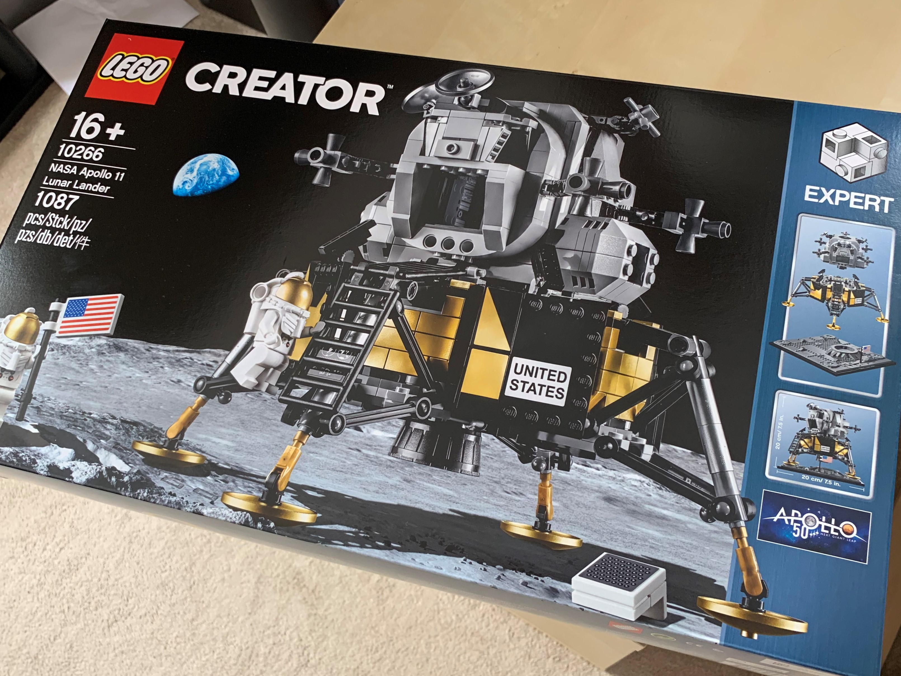

Amos Tversky and Daniel Kahneman coined the term _loss aversion_ back in the 1970s.  The psychological theory goes that you feel the pain of losing something you already have more than the joy at getting a new thing.  

This works in all aspects of life, and you'll often see it done in marketing or sales processes.  The free 100-night trial of Tempur mattresses is a good example - an expensive purchase, but you'll soon feel the pain of losing it after the trial.

Anyway, over the past year, I've been struggling to keep the weight off and make time for exercise, as commitments keep building.

Drastic action was needed - the [Miracle Morning book](/posts/2019/book-summary-miracle-morning) had a great line - "make time for exercise now, or make time for illness later".  That resonated with me, and it was time to kick-start the exercise habit.

A lot of people might promise themselves a _treat_ once they hit their exercise milestones.  I wanted to flip that around - 

1. Set the target
2. Buy the treat
3. Make failure not an option

## 1. Set the target
This part is simple.  From today, I will complete 30 exercise sessions before the end of August.

For simplicity, I'll define an exercise session as a deliberate act (so just casual walks don't count) - it's got to be a run, gym, swim or power-walk.  Anything that gets the blood pumping!  

It's all about getting used to getting out and exercising - just getting going is the main aim.

## 2. Buy the treat
Around the time I conceived this idea, it was approaching the anniversary of the Moon Landings, an amazing part of human history.  I'd seen LEGO had just created an awesome new model of the Apollo Lunar Lander Module, so from there, _Apollo 30_ was born.   

I ordered the LEGO, and now the unopened box is sitting in my office, taunting me to get off my arse and get moving.

## 3. Make failure not an option
Here's the twist, an extra jolt of energy to really hammer the point home... 

**If I fail, I will give the model away to my arch-enemy.**

Oh yes, that's got my mind focused.  Now, I've not got many arch-enemies... if fact, just this one person, they wouldn't even know, and it's more of a mild dislike than arch-enemy status, but it's a great visualisation trick.  I can think about what that might look like as I hand over the LEGO model to them - their confused face, my immense sorrow and regret.  That's not going to happen.

This feels like a much more powerful way to set tough goals.  If you have someone in mind as an 'arch-enemy' even better - leverage those thoughts and channel the energy into success... it'll be the thing that motivates you on dark rainy days or freezing winter mornings.

I'll post updates as I go and let you know how I get on.

