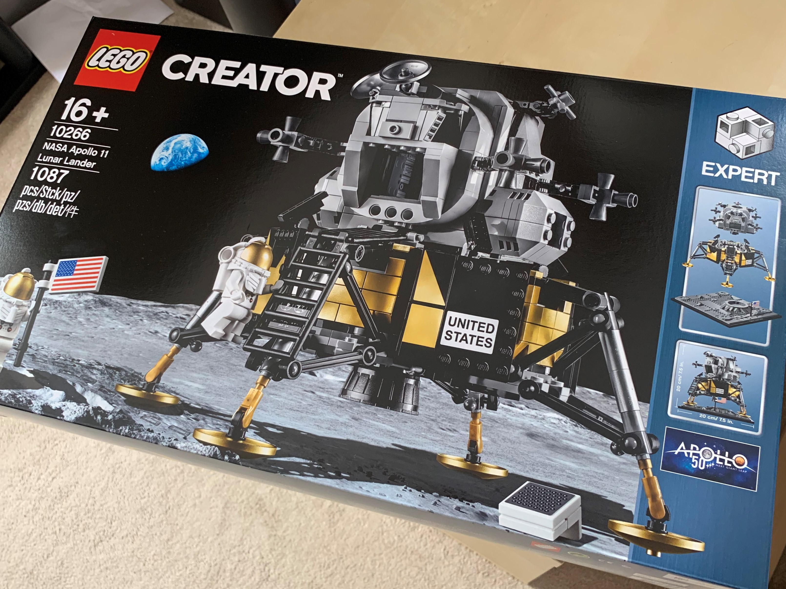

It's mid-August, and I'm now roughly halfway through my [Apollo 30 exercise challenge](/posts/2019/loss-aversion-kick-off).

So far I've... 
* Done 10 exercises
* Burnt around 4000 more calories than normal

The overall target was 30 exercises, so I'm playing catchup for the second half, with 18 days left in August, but 20 exercise sessions to complete.

This is a good lesson in breaking targets down to smaller chunks so that I'm accountable each week.

I'm already formulating plans for a bigger loss aversion experiment to focus on after the summer, and will look to build in weekly targets and mini-deadlines.

